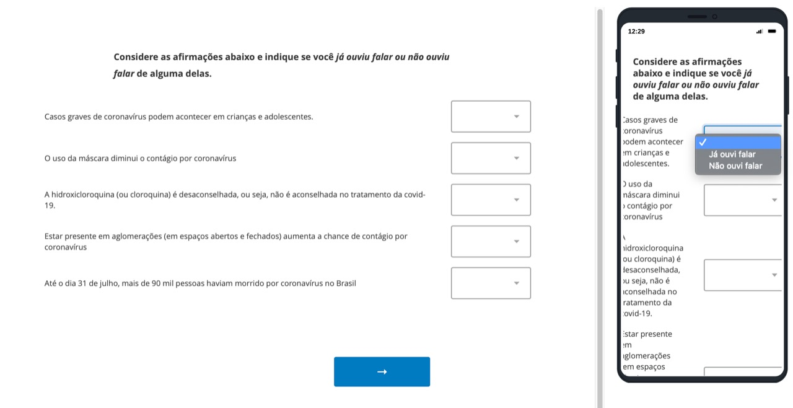

```{r setup, include=FALSE}
knitr::opts_chunk$set(
	echo=FALSE,
	message = FALSE,
	warning = FALSE,
	fig.align = "center"
)
```

```{r pacotes, message=FALSE, warning=FALSE, include=FALSE}
library(tidyverse) 
library(kableExtra)
library(xaringanthemer)
library(RefManageR)
library(readr)
```

```{r xaringan-themer, include=FALSE, warning=FALSE}
style_mono_accent(
  base_color = "#04324c",
  inverse_background_color = "#066395",
  header_font_google = google_font("Josefin Sans"),
  text_font_google   = google_font("Montserrat", "300", "300i"),
  code_font_google   = google_font("Fira Mono"),
)

```

```{r, load_refs, include=FALSE, cache=FALSE}
BibOptions(check.entries = FALSE,
           bib.style = "authoryear",
           cite.style = "alphabetic",
           style = "markdown",
           max.names = 3,
           hyperlink = FALSE,
           dashed = TRUE)
myBib <- ReadBib("referencias/referencias.bib", check = FALSE)
```

## Nota metodológica


- Período de coleta: 02/08/2020 à __/08/2020

- Divulgação através de redes sociais: Facebook, Twitter, WhatsApp

- Número de respostas: ____

- Plataforma de questionário utilizada: 

```{r echo=FALSE, out.width="50%", include=TRUE}

```


---
class: middle

# Exemplo da plataforma

## Qualtrics

```{r echo=FALSE, out.width="100%", include=TRUE}

```

---
## Análise dos dados

- `R` `r NoCite(myBib, c("R-Core", "RStudio"))` e `RStudio`:

```{r echo=FALSE, out.width="50%", include=TRUE}
knitr::include_graphics("img/rstudio-r.jpg")
```

- Pacotes do `tidyverse` `r NoCite(myBib, "tidyverse")`:

```{r echo=FALSE, out.width="25%", include=TRUE}
knitr::include_graphics("img/hex-tidyverse.png")
```

---
### Análise dos dados

Os dados foram exportados do Qualtrics como arquivo `.csv`

- Os dados foram importados para o R e arrumados: 

  - Remoção de linhas em qual nenhuma das perguntas foi respondida

  - Alteração do nome das colunas

  - Remoção de respostas de pessoas menores de 18 anos
  
  - Criação de nova coluna de Região, baseado nas respostas obtidas sobre o estado (UF) em qual reside


```{r include=FALSE}
base_survey <-
  read_csv("dados/survey-04-08.csv",
           locale = locale(encoding = "UTF-8"),
           skip = 1)


glimpse(base_survey)
```


```{r include=FALSE}
base_survey_renomeada <- base_survey %>%
    slice(-1) %>%  # retira a primeira linha, não contém dados da base
  janitor::clean_names() %>% 
  rename(
    plataforma_info = 11,
    plataforma_info_outros = 12,
    instituicao_info = 13,
    instituicao_info_outros = 14,
    ocupacoes_info = 15,
    ocupacoes_info_outros = 16,
    
    
    ouviu_falar_casos_graves = 17, 
    ouviu_falar_mascara = 18,
    ouviu_falar_cloroquina = 19, 
    ouviu_falar_aglomeracao = 20, 
    ouviu_falar_mortes = 21,   
    
    concorda_casos_graves = 22, 
    concorda_mascara = 23,
    concorda_cloroquina = 24, 
    concorda_aglomeracao = 25, 
    concorda_mortes = 26,   
    
    idade = 27,
    sexo = 28,
    estado = 29,
    rural_ou_urbano = 30,
    escolaridade = 31,
    religiao = 32,
    religiao_outros = 33,
    faixa_renda = 34
  ) 

glimpse(base_survey_renomeada)

base_limpa <- base_survey_renomeada %>%
  filter(!is.na(plataforma_info)) %>%
  filter(idade != "Menos de 18 anos") %>%  # Retira pessoas menores de 18 anos da base de dados
  mutate(
    regiao_br = case_when(
      estado %in% c(
        "Amazonas",
        "Roraima",
        "Amapá",
        "Pará",
        "Tocantins",
        "Rondônia",
        "Acre"
      ) ~ "Norte",
      
      estado %in% c("Mato Grosso do Sul", "Mato Grosso", "Goiás") ~ "Centro-Oeste",
      
      estado %in% c(
        "Maranhão",
        "Piauí",
        "Ceará",
        "Rio Grande do Norte",
        "Pernambuco",
        "Paraíba",
        "Sergipe",
        "Alagoas",
        "Bahia"
      ) ~ "Nordeste",
      
      estado %in% c("Rio de Janeiro", "São Paulo", "Minas Gerais", "Espírito Santo") ~ "Sudeste",
      
      estado %in% c("Paraná", "Santa Catarina", "Rio Grande do Sul") ~ "Sul"
    )
  )

```


---

## Perfil das pessoas entrevistadas

```{r include=FALSE}

porcentagem <- function(data, var){
  data %>%
    group_by({{var}}) %>% 
    summarise(quantidade = n()) %>% 
    mutate(porcentagem = round(100 * quantidade/sum(quantidade), 1)) %>% 
    select(-quantidade) %>% 
    rename("Porcentagem (%)" = 2) %>% 
    knitr::kable()
}

```


### Sexo 

```{r echo=FALSE}
porcentagem(base_limpa, sexo)

```

---

## Perfil das pessoas entrevistadas

### Região 

```{r}
porcentagem(base_limpa, regiao_br)

```

---

## Perfil das pessoas entrevistadas

### Idade 

```{r}
porcentagem(base_limpa, idade)

```

---

## Perfil das pessoas entrevistadas

### Rural ou urbano?

```{r}
porcentagem(base_limpa, rural_ou_urbano)

```


---

## Perfil das pessoas entrevistadas

### Escolaridade

```{r}
porcentagem(base_limpa, escolaridade)

```


---

## Perfil das pessoas entrevistadas

### Religião

```{r}
porcentagem(base_limpa, religiao)

```


---

## Perfil das pessoas entrevistadas

### Faixa de Renda

```{r}
porcentagem(base_limpa, faixa_renda)

```


---

## Resultados

xxx


---
## Desafios/Aprendizados

- Pergunta sobre sexo: utilizamos como referência o IBGE. Porém não foi inclusivo e não abrange todas as possibilidades.


---
## Referências


```{r refs, echo=FALSE, results="asis", include=TRUE}
PrintBibliography(myBib)
```
